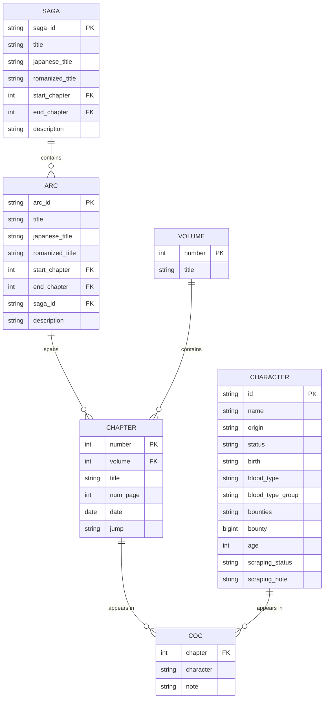

# Database Schema Documentation

## Overview

The One Piece of Data database uses DuckDB and consists of six main tables that store comprehensive information about the One Piece manga structure, including chapters, volumes, characters, story arcs, and sagas.

## Entity Relationship Diagram



## Table Schemas

### 1. SAGA Table
Stores information about major story sagas (collections of arcs).

| Column | Type | Constraints | Description |
|--------|------|-------------|-------------|
| `saga_id` | TEXT | PRIMARY KEY | Unique identifier for the saga |
| `title` | TEXT | NOT NULL | English title of the saga |
| `japanese_title` | TEXT | | Japanese title of the saga |
| `romanized_title` | TEXT | | Romanized Japanese title |
| `start_chapter` | INTEGER | NOT NULL, FK → chapter(number) | First chapter of the saga |
| `end_chapter` | INTEGER | NOT NULL, FK → chapter(number) | Last chapter of the saga |
| `description` | TEXT | | Description of the saga |

**Example Data:**
```sql
INSERT INTO saga VALUES 
('east_blue', 'East Blue', '東の青', 'Higashi no Ao', 1, 100, 'The beginning of Luffy''s journey'),
('alabasta', 'Alabasta', 'アラバスタ編', 'Arabasuta-hen', 101, 217, 'The desert kingdom arc');
```

### 2. ARC Table
Stores information about individual story arcs within sagas.

| Column | Type | Constraints | Description |
|--------|------|-------------|-------------|
| `arc_id` | TEXT | PRIMARY KEY | Unique identifier for the arc |
| `title` | TEXT | NOT NULL | English title of the arc |
| `japanese_title` | TEXT | | Japanese title of the arc |
| `romanized_title` | TEXT | | Romanized Japanese title |
| `start_chapter` | INTEGER | NOT NULL, FK → chapter(number) | First chapter of the arc |
| `end_chapter` | INTEGER | NOT NULL, FK → chapter(number) | Last chapter of the arc |
| `saga_id` | TEXT | FK → saga(saga_id) | Parent saga this arc belongs to |
| `description` | TEXT | | Description of the arc |

**Example Data:**
```sql
INSERT INTO arc VALUES 
('romance_dawn', 'Romance Dawn', 'ロマンスドーン', 'Romansu Dōn', 1, 7, 'east_blue', 'Luffy begins his adventure'),
('orange_town', 'Orange Town', 'オレンジタウン', 'Orenji Taun', 8, 21, 'east_blue', 'Meeting Buggy the Clown');
```

### 3. VOLUME Table
Stores information about manga volumes.

| Column | Type | Constraints | Description |
|--------|------|-------------|-------------|
| `number` | INTEGER | PRIMARY KEY | Volume number |
| `title` | TEXT | | English title of the volume |

**Example Data:**
```sql
INSERT INTO volume VALUES 
(1, 'Romance Dawn'),
(2, 'Buggy the Clown'),
(3, 'Don''t Get Fooled Again');
```

### 4. CHAPTER Table
Stores information about individual manga chapters.

| Column | Type | Constraints | Description |
|--------|------|-------------|-------------|
| `number` | INTEGER | PRIMARY KEY | Chapter number |
| `volume` | INTEGER | FK → volume(number) | Volume this chapter belongs to |
| `title` | TEXT | | English title of the chapter |
| `num_page` | INTEGER | | Number of pages in the chapter |
| `date` | DATE | | Release date of the chapter |
| `jump` | TEXT | | Weekly Shonen Jump issue information |

**Example Data:**
```sql
INSERT INTO chapter VALUES 
(1, 1, 'Romance Dawn', 54, '1997-07-22', 'Weekly Shonen Jump 1997 #34'),
(2, 1, 'They Call Him "Straw Hat Luffy"', 20, '1997-08-04', 'Weekly Shonen Jump 1997 #36');
```

### 5. CHARACTER Table
Stores detailed information about One Piece characters.

| Column | Type | Constraints | Description |
|--------|------|-------------|-------------|
| `id` | TEXT | PRIMARY KEY | Unique character identifier |
| `name` | TEXT | | Character name |
| `origin` | TEXT | | Character's place of origin |
| `status` | TEXT | | Current status (alive, dead, unknown) |
| `birth` | TEXT | | Birthday information |
| `blood_type` | TEXT | | Blood type |
| `blood_type_group` | TEXT | | Blood type group classification |
| `bounties` | TEXT | | Bounty history as text |
| `bounty` | BIGINT | | Current/latest bounty amount |
| `age` | INT | | Character age |
| `scraping_status` | TEXT | | Data quality status |
| `scraping_note` | TEXT | | Notes about data extraction |

**Example Data:**
```sql
INSERT INTO character VALUES 
('monkey_d_luffy', 'Monkey D. Luffy', 'East Blue', 'Alive', 'May 5th', 'F', 'F', '1,500,000,000', 1500000000, 19, 'complete', NULL),
('roronoa_zoro', 'Roronoa Zoro', 'East Blue', 'Alive', 'November 11th', 'XF', 'XF', '1,111,000,000', 1111000000, 21, 'complete', NULL);
```

### 6. COC Table (Character of Chapter)
Junction table linking characters to chapters they appear in.

| Column | Type | Constraints | Description |
|--------|------|-------------|-------------|
| `chapter` | INTEGER | FK → chapter(number) | Chapter number |
| `character` | TEXT | | Character name (not FK to allow flexibility) |
| `note` | TEXT | | Additional notes about the appearance |

**Example Data:**
```sql
INSERT INTO coc VALUES 
(1, 'Monkey D. Luffy', 'Main character introduction'),
(1, 'Alvida', 'Antagonist'),
(2, 'Monkey D. Luffy', NULL),
(2, 'Koby', 'Supporting character');
```

## Relationships

1. **SAGA → ARC**: One-to-many (one saga contains multiple arcs)
2. **ARC → CHAPTER**: Many-to-many via chapter ranges (arcs span multiple chapters)
3. **VOLUME → CHAPTER**: One-to-many (one volume contains multiple chapters)
4. **CHAPTER ↔ CHARACTER**: Many-to-many via COC table (characters appear in multiple chapters, chapters feature multiple characters)

## Indexes and Performance

### Recommended Indexes
```sql
-- Primary performance indexes
CREATE INDEX idx_chapter_volume ON chapter(volume);
CREATE INDEX idx_coc_chapter ON coc(chapter);
CREATE INDEX idx_coc_character ON coc(character);
CREATE INDEX idx_arc_saga ON arc(saga_id);
CREATE INDEX idx_arc_chapters ON arc(start_chapter, end_chapter);
CREATE INDEX idx_saga_chapters ON saga(start_chapter, end_chapter);

-- Date and numeric indexes for analytics
CREATE INDEX idx_chapter_date ON chapter(date);
CREATE INDEX idx_character_bounty ON character(bounty);
```

## Common Queries

### 1. Get all arcs in a saga
```sql
SELECT a.title, a.start_chapter, a.end_chapter 
FROM arc a 
JOIN saga s ON a.saga_id = s.saga_id 
WHERE s.title = 'East Blue'
ORDER BY a.start_chapter;
```

### 2. Find characters in a specific chapter
```sql
SELECT c.character, c.note 
FROM coc c 
WHERE c.chapter = 1;
```

### 3. Get chapter count per volume
```sql
SELECT v.title, COUNT(c.number) as chapter_count
FROM volume v
LEFT JOIN chapter c ON v.number = c.volume
GROUP BY v.number, v.title
ORDER BY v.number;
```

### 4. Find highest bounty characters
```sql
SELECT name, bounty 
FROM character 
WHERE bounty IS NOT NULL 
ORDER BY bounty DESC 
LIMIT 10;
```

### 5. Get saga/arc structure
```sql
SELECT 
    s.title as saga,
    a.title as arc,
    a.start_chapter,
    a.end_chapter,
    (a.end_chapter - a.start_chapter + 1) as chapter_count
FROM saga s
LEFT JOIN arc a ON s.saga_id = a.saga_id
ORDER BY s.start_chapter, a.start_chapter;
```

## Data Quality Notes

- **Character data**: Includes scraping status tracking for data quality monitoring
- **Dates**: Stored in ISO format (YYYY-MM-DD) when available
- **Bounties**: Stored both as text (for historical tracking) and numeric (for queries)
- **Foreign keys**: Ensure referential integrity between related tables
- **Null handling**: Optional fields allow for incomplete data while maintaining structure

This schema provides a comprehensive foundation for analyzing One Piece manga structure and character relationships across the series.
